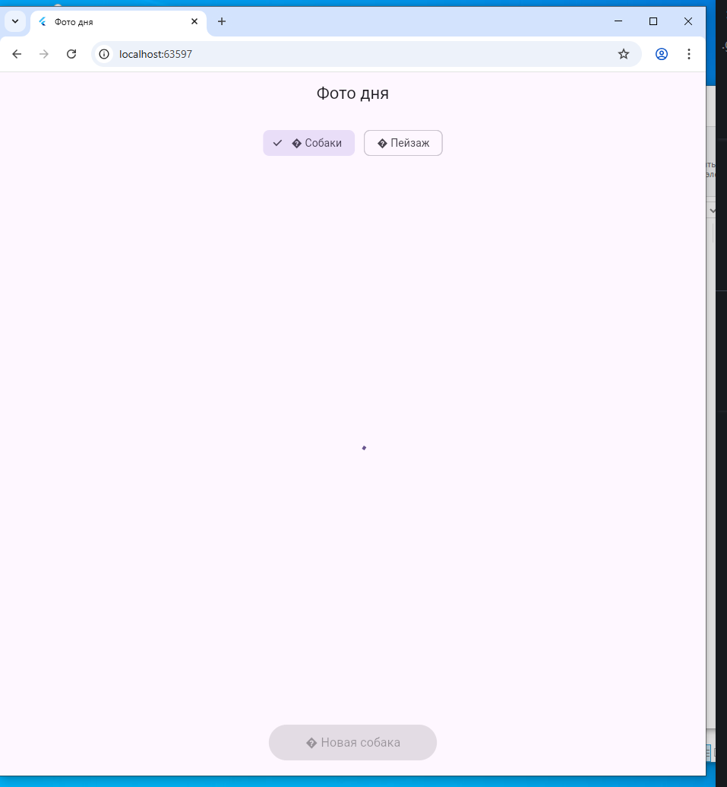

# Лабораторная работа №5: Фото дня

Приложение для просмотра случайных фотографий

## Информация об авторе
- **ФИО:** Беляев Владимир и Селиванов Павел
- **Группа:** ИСП-233

## Стек и версии
- **Flutter версия:** 3.18.0+
- **Dart версия:** 3.11.0
- **Платформа:** Web (Chrome)
- **Пакеты:** http (для сетевых запросов)

## Скриншот приложения


## Как запустить

1. Клонируйте репозиторий:
    ```bash
    git clone https://github.com/VladimirBelyaev01/F1_Lab5_NoHomework.git

2. Перейдите в папку проекта
    ```bash
    cd photo_of_the_day

3. Установите зависимости
    ```bash
    flutter pub get

4. Запустите приложение в Хром:
    ```bash
    flutter run -d chrome
 
 ## Что изучили
 Асинхронное программирование — освоил работу с Future, async и await для выполнения асинхронных операций.

 HTTP-запросы — научился отправлять GET-запросы с помощью пакета http и обрабатывать ответы.

 Состояние StatefulWidget — понял, как управлять состоянием и использовать setState() для обновления UI.

 Обработка ошибок — освоил перехват исключений с помощью try/catch в асинхронном коде.

 ChoiceChip — научился использовать виджеты выбора для переключения между категориями фото.

    
 ## Ответы на вопросы

 1. Что такое Future<T>? Чем отличается от обычного возвращаемого значения?

Future<T> — это объект, который представляет собой обещание получить значение типа T в будущем. В отличие от обычного возвращаемого значения, которое возвращается сразу, Future возвращается мгновенно, а реальное значение будет доступно позже (например, после загрузки данных из интернета). Обычное значение синхронно, Future — асинхронно.

2. Что делает await? Блокирует ли он весь поток выполнения?

await приостанавливает выполнение асинхронной функции до тех пор, пока Future не завершится, и возвращает результат. Он НЕ блокирует весь поток выполнения — блокируется только текущая асинхронная функция, а другие части приложения (интерфейс, другие асинхронные операции) продолжают работать.

3. Зачем setState() вызывается дважды в _fetchPhoto()?

Первый setState() в начале _fetchPhoto() нужен, чтобы показать индикатор загрузки (CircularProgressIndicator) и очистить предыдущие ошибки и изображения. Второй setState() в конце нужен, чтобы скрыть индикатор загрузки и отобразить загруженное изображение или сообщение об ошибке. Каждый вызов setState() перерисовывает UI с новым состоянием.

4. Почему кнопке передаётся _fetchPhoto без скобок, а не _fetchPhoto()?

_fetchPhoto без скобок передаётся как ссылка на функцию (callback). Скобки _fetchPhoto() вызвали бы функцию сразу при построении виджета. Кнопке нужно передать функцию, которую она вызовет позже, при нажатии — поэтому передаётся ссылка, а не результат вызова.

5. Чем Image.network() отличается от Image.asset()?

Image.network() загружает изображение из интернета по URL-адресу. Image.asset() загружает локальное изображение из папки assets проекта. Network загружается асинхронно, может выдавать ошибки при отсутствии сети, требует разрешений на Android/iOS. Asset загружается мгновенно из локальной папки, всегда доступно, не требует интернета.
